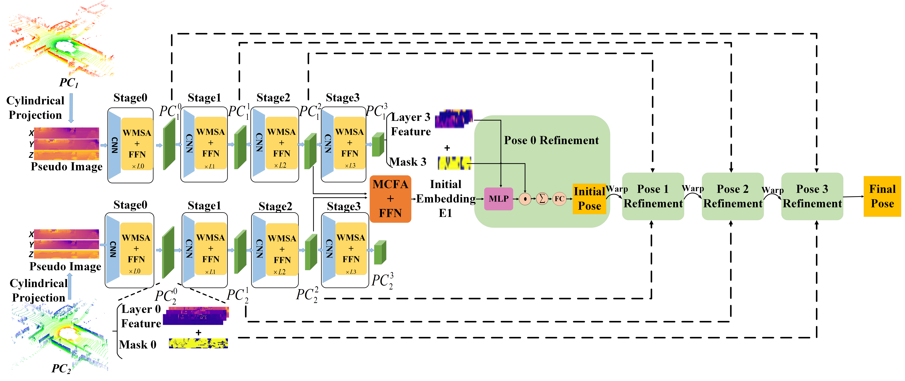
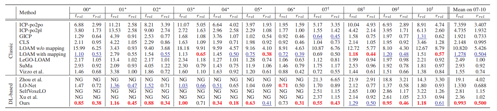

# TransLO: A Window-Based Masked Point Transformer Framework for Large-Scale LiDAR Odometry (AAAI2023)
This is official implementation for our AAAI2023 paper "TransLO: A Window-Based Masked Point Transformer Framework for Large-Scale LiDAR Odometry" created by Jiuming Liu, Guangming Wang, Chaokang Jiang, Zhe Liu, and Hesheng Wang.


## Installation
Our model only depends on the following commonly used packages.

| Package      | Version                          |
| ------------ | -------------------------------- |
| CUDA         |  1.11.3                          |
| PyTorch      |  1.10.0                          |
| h5py         | *not specified*                  |
| tqdm         | *not specified*                  |
| numpy        | *not specified* (we used 1.20.2) |
| scipy        | *not specified* (we used 1.6.2)  |

## Install the pointnet2 library
Compile the furthest point sampling, grouping and gathering operation for PyTorch with following commands. 
```bash
cd ops_pytorch
cd fused_conv_random_k
python setup.py install
cd ../
cd fused_conv_select_k
python setup.py install
cd ../
```
## Datasets

Datasets are available at KITTI Odometry benchmark website: [ https://drive.google.com/drive/folders/1Su0hCuGFo1AGrNb_VMNnlF7qeQwKjfhZ](https://www.cvlibs.net/datasets/kitti/eval_odometry.php)
The data of the KITTI odometry dataset should be organized as follows:

```
data_root
├── 00
│   ├── velodyne
│   ├── calib.txt
├── 01
├── ...
```

## Training
Train the network by running :
```bash
python train.py 
```
Please reminder to specify the `GPU`, `data_root`,`log_dir`, `train_list`(sequences for training), `val_list`(sequences for validation) in the scripts.
You may specify the value of arguments. Please find the available arguments in the configs.py. 

## Testing
Evaluate the network by running :
```bash
python train.py
```
Please reminder to specify the `GPU`, `data_root`,`log_dir`, `test_list`(sequences for testing) in the scripts.

### Quantitative results:


## Citation
```
@inproceedings{liu2023translo,
  title={TransLO: A Window-Based Masked Point Transformer Framework for Large-Scale LiDAR Odometry},
  author={Liu, Jiuming and Wang, Guangming and Jiang, Chaokang and Liu, Zhe and Wang, Hesheng},
  booktitle={Proceedings of the AAAI Conference on Artificial Intelligence},
  volume={37},
  number={2},
  pages={1683--1691},
  year={2023}
}
```
### Acknowledgments
We thank the following open-source project for the help of the implementations:
- [PointNet++](https://github.com/charlesq34/pointnet2) 
- [KITTI_odometry_evaluation_tool](https://github.com/LeoQLi/KITTI_odometry_evaluation_tool) 
- [PWCLONet] (https://github.com/IRMVLab/PWCLONet)


